# AYGO-04

# AWS Serverless Application Model

Following the tutorial for the serverless application the next arquitecture was implemented using AWS Cognito, Lambda, Amplify and DynamoDB

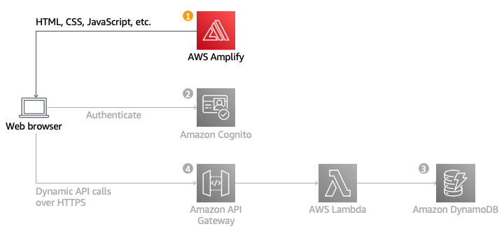

## Upload to Amplify

Using this repository, the service of Amplify deployed the web application. It builds the application and deploys it automatically when a new commit to a specified branch is pushed.

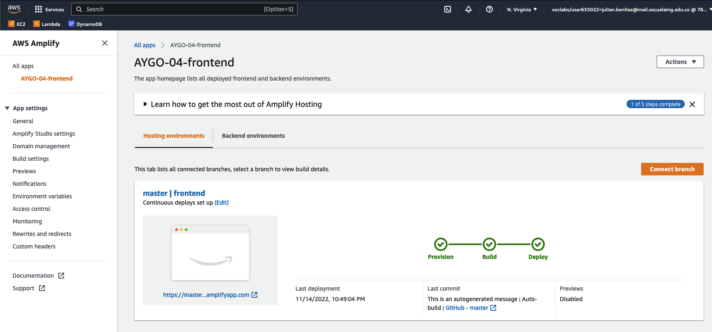

## Configure Cognito

A Cognito service is created.

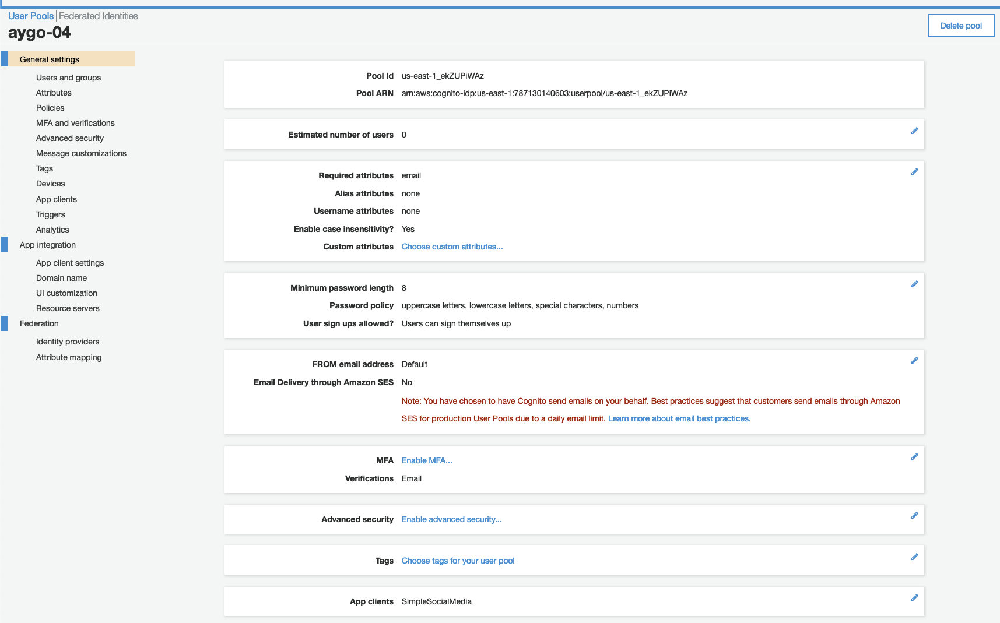

The client app is configured with a domain.
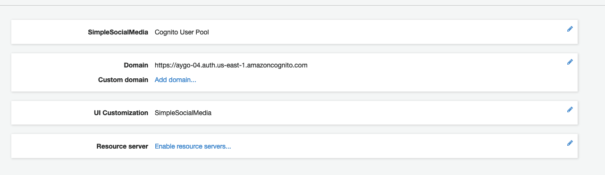

The signin will show as
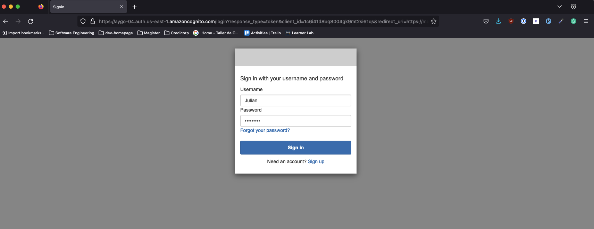

Once the sign up is used, the users will be visible.
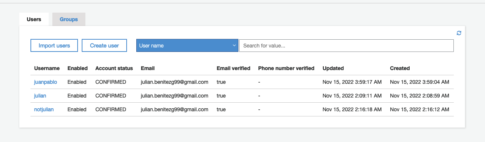

## DynamoDB

Two tables were created:

1. `connections`: To handle wss connections.
2. `posts`: To save all users' posts
   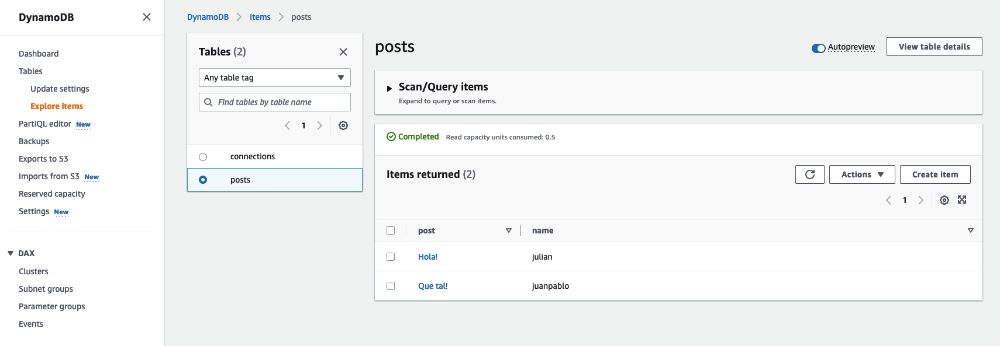

## Lambdas

Two lambdas were created, check the [lambda](lambda/) folder:

1. `lambda_http_post`: It handles http requests for obtaining all posts from the DB.
2. `lambda_posts`: It handles wss connections.

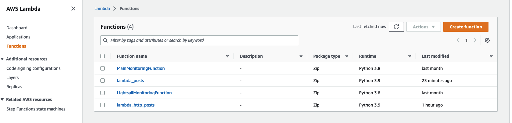

## Create API Gateway

Two API gateways were created, one for REST and the other for WebSockets.
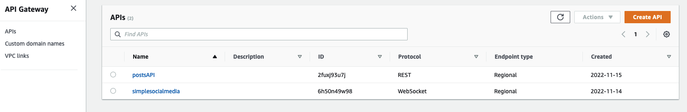

The REST gateway has one route `GET` for obtaining the posts from the DB.

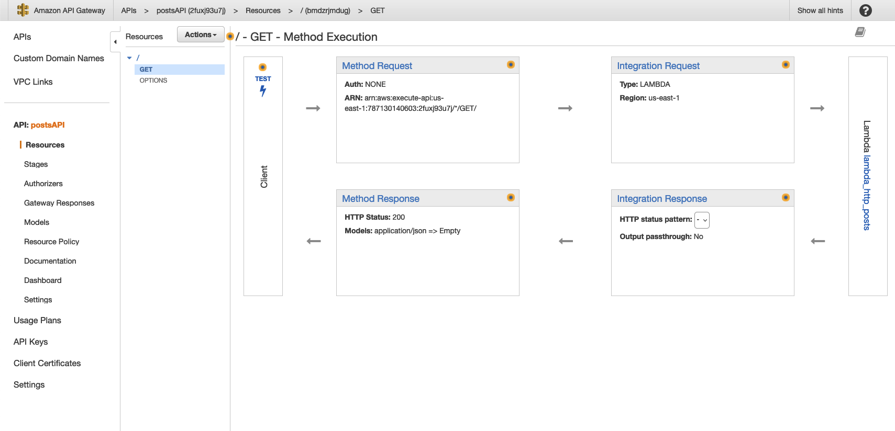

The WSS gateway has 3 routes:

1. `$connect`: A user connecting triggers this action.
2. `$disconnect`: A user disconnecting triggers this action.
3. `sendpost`: An action for sending messages.

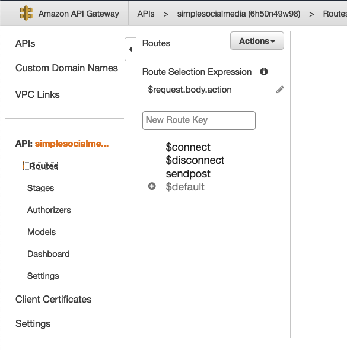

# App running

Check the demo of the app running in AWS.

Some images:

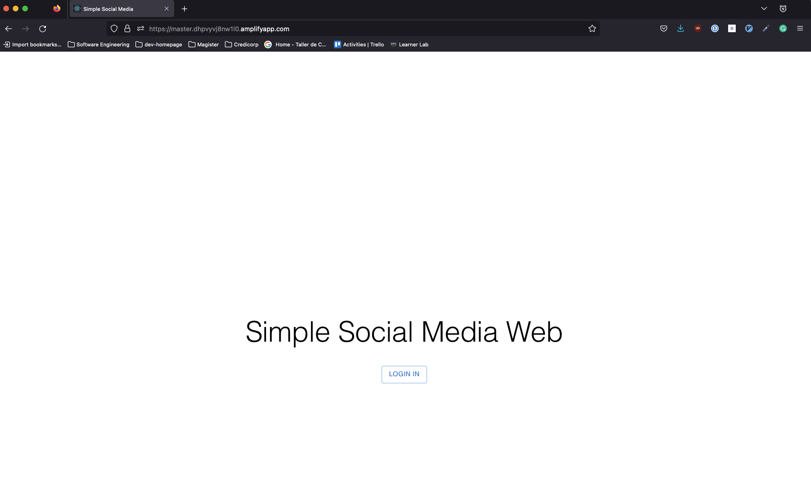

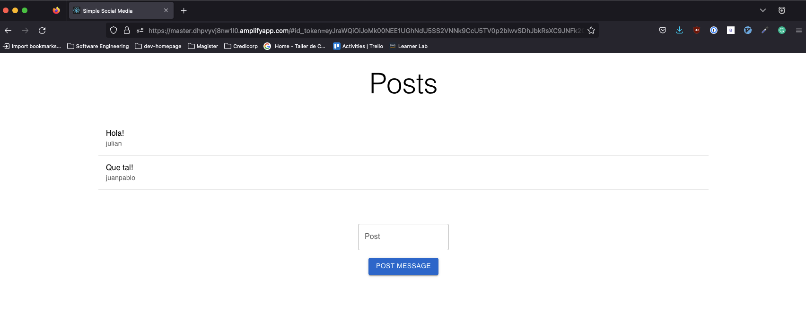

# License

GNU GENERAL PUBLIC LICENSE [LICENSE.md](LICENSE.md)

# References

- [Build Serverless Application](https://aws.amazon.com/es/getting-started/hands-on/build-serverless-web-app-lambda-apigateway-s3-dynamodb-cognito/)
- [API Gateway Websockets](https://docs.aws.amazon.com/amazondynamodb/latest/developerguide/example_cross_ApiGatewayWebsocketChat_section.html)
- [Login endpoint Cognito](https://docs.aws.amazon.com/cognito/latest/developerguide/login-endpoint.html)

# Author

- Julián Benítez Gutiérrez - _Development_ - [julianbenitez99](https://github.com/julianbenitez99)
